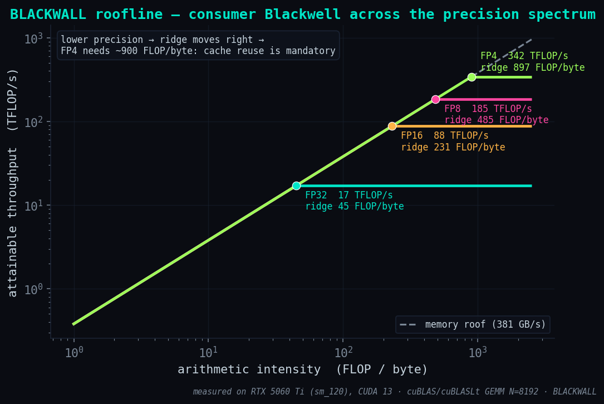
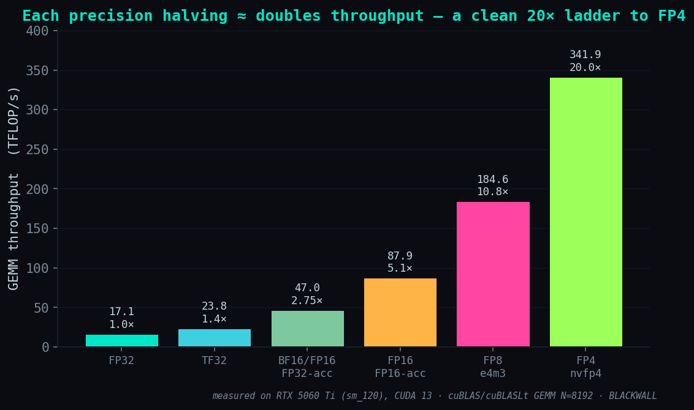

# BLACKWALL

> *The netrunners run the Blackwall. I run **with** the Blackwell.*

Honest roofline characterization of the **NVIDIA Blackwell** tensor cores
(consumer, **sm_120**, RTX 5060 Ti) across the **precision spectrum** —
FP32 → TF32 → BF16 → FP16 → FP8 → FP4. Measured on the metal. No inflated numbers.

The dive: lower precision = deeper into the Net = faster, more dangerous (lossier).
This repo measures exactly *how much* faster, at *what* depth — and tells the truth
about the trade.

> **`:: SISTER OP`** — [**ICEPICK**](https://github.com/QuantumDrizzy/ICEPICK) goes *under* the
> roofline: it cracks the **microarchitecture** (instruction latency, cache/memory hierarchy)
> by SASS + microbenchmarking. BLACKWALL maps the **compute**; ICEPICK dissects the **silicon
> beneath it**. Same die, two blades.

---

## The trace — `:: BREACH` + `:: DEEP DIVE` (cuBLAS/cuBLASLt GEMM, N = 8192)



GPU: **RTX 5060 Ti** · sm_120 · 36 SMs · ~2.57 GHz · FP32 CUDA-core peak **23.7 TFLOP/s**

| precision | TFLOP/s | vs FP32 |
|-----------|--------:|--------:|
| FP32 (CUDA cores)             |  17.1 | 1.00× — **72% of peak** |
| TF32                          |  23.8 | 1.39× |
| BF16 / FP16 (FP32 accumulate) |  47.0 | 2.75× |
| FP16 (FP16 accumulate)        |  87.9 | 5.15× |
| FP8 e4m3 → bf16               | 184.6 | 10.82× |
| **FP4 nvfp4 → bf16**          | **341.9** | **20.04×** |



**What the trace says — honestly:**
- FP32 SGEMM sits at **72% of the computed CUDA-core peak** — a healthy anchor. The
  measurement is real, not cherry-picked.
- **FP32 accumulation costs ~2× on the tensor cores.** The "safe-for-training" path
  (BF16/FP16 + FP32 accumulate) is ~46 TFLOP/s; dropping to FP16 accumulate nearly
  doubles it to ~86. Speed vs numerical headroom — that trade *is* mixed precision.
- **FP8 reaches 185 TFLOP/s (10.8×); FP4 (nvfp4) reaches 342 TFLOP/s (20×).** Each
  precision halving ≈ doubles throughput — a clean, consistent ladder (FP4 ≈ 2× FP8,
  ≈ 90% of the estimated dense-FP4 ceiling). **That consistency is the evidence the
  numbers are real, not flukes.** This is where consumer Blackwell earns its keep.

---

## Honesty contract (non-negotiable)

- TFLOP/s from **CUDA-event timing, warmup, mean over many iters** — never a max.
- The FP32 peak is **computed** (cores × 2 × boost clock) and reported as **% of peak**.
  Tensor rows report absolute + speedup vs FP32 — **no vendor "AI TOPS"** quoted
  (those are sparse / FP4 and not comparable to dense GEMM here).
- `[KNOWN_LIMIT]` consumer Blackwell ≠ datacenter (no NVLink/HBM; FP64 is crippled
  on GeForce and deliberately not characterized).
- **The throughput numbers are honest and consistent; numerical correctness is the one
  open gate.** This pass uses zero data + dummy block scales — valid for *timing* (GEMM
  doesn't short-circuit on zeros), but the low-precision results are **not yet verified**
  against an FP32 reference. For FP4 that matters most — *a fast 4-bit GEMM that is wrong
  is worthless.* Real-data quantization + per-block scaling vs an FP32 reference is
  `THE TRACE`'s remaining work — **documented, not faked.**

---

## Phases (netrunner ops)

| op | what | status |
|----|------|--------|
| **BREACH**    | cuBLAS GEMM roofline, FP32 → FP8 | ✅ done |
| **DEEP DIVE** | FP4 (nvfp4) via cuBLASLt block-scaling, beyond the wall | ✅ done |
| **THE TRACE** | roofline figure ✅ · numerical correctness (FP8/FP4 vs FP16 ref) ⏳ | partial |
| **RAM**       | GDDR7 memory bandwidth | ⏳ |

---

## Build & run

```bash
# Load the MSVC env first. NOTE: call vcvars64.bat WITHOUT `>nul` —
# redirecting its output leaves cl.exe off PATH and nvcc can't find the host compiler.
call "...\VC\Auxiliary\Build\vcvars64.bat"
nvcc -O3 -arch=sm_120 src/gemm_bench.cu -lcublas -lcublasLt -o gemm_bench
./gemm_bench
```

## Hardware / toolchain
RTX 5060 Ti (Blackwell, sm_120, 16 GB) · CUDA 13.0 · cuBLAS / cuBLASLt · MSVC 14.44.

---
*Honest roofline. No 354×. The trace doesn't lie.* 👽⚡
